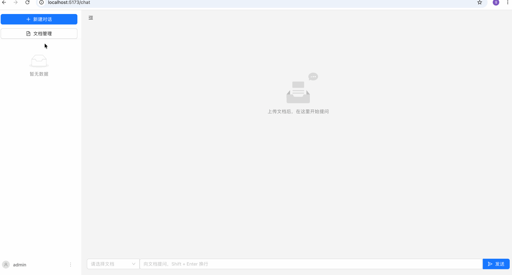

# DocMind · 基于 RAG 的文档知识库问答

上传文档，针对文档内容提问，回答**流式输出**并附带**引用来源**，支持多轮对话、按文档过滤检索。




## 功能

- 📄 文档上传与管理，支持 PDF / Word / TXT / Markdown，异步解析入库，实时状态轮询
- 💬 流式问答，打字机效果 + 引用来源展示（精确到文档与分块）
- 🔄 多轮对话，支持指代消解（"它有什么优点？"会被自动改写为完整问题再检索）
- 🎯 支持限定检索范围（只针对选中的某几个文档提问）
- 🔐 用户注册登录，JWT 鉴权，业务数据按用户隔离
- 🐳 Docker Compose 一键部署

## 架构

```
┌─────────────┐      SSE/REST      ┌──────────────────┐      REST/SSE      ┌──────────────────┐
│   React     │ ──────────────────▶│   Java Gateway    │ ──────────────────▶│  Python RAG       │
│  (Vite+TS)  │                     │  (Spring Boot)     │                     │   (FastAPI)       │
└─────────────┘                     └──────────────────┘                     └──────────────────┘
                                             │                                         │
                                             ▼                                         ▼
                                      ┌─────────────┐                         ┌──────────────┐
                                      │ PostgreSQL   │                         │ FAISS + Ollama │
                                      │ (业务数据)    │                         │ (向量检索+生成) │
                                      └─────────────┘                         └──────────────┘
```

**职责划分**：
- **React**：界面展示、SSE 流解析、状态管理
- **Java Gateway**：用户鉴权、会话与消息持久化、SSE 透传、业务编排，不做任何 AI 相关计算
- **Python RAG Service**：文档解析、向量检索、Prompt 编排、调用大模型生成回答

三层之间互不越权——Java 不理解 RAG 的具体实现，Python 不关心用户是谁，各自只做自己该做的事。

## 技术栈

| 层 | 技术 |
|---|---|
| 前端 | React 18、TypeScript、Vite、Ant Design、TanStack Query、Zustand、React Router |
| 业务网关 | Java 21、Spring Boot 3.5.6、MyBatis-Plus、PostgreSQL、WebFlux(WebClient) |
| AI 服务 | Python、FastAPI、LangChain、FAISS、Ollama |
| 部署 | Docker、Docker Compose |

## 核心技术点

### 1. RAG 检索编排

检索（向量相似度召回相关片段）→ 拼装（按模板组织资料与规则）→ 生成（模型基于资料流式作答），三步串联，模型被严格约束"只使用资料中的信息"，资料不足时明确回答"资料未提供相关信息"而非编造。多轮对话场景下，追问会先经过一次低温度的改写（condense question），把"它有什么优点？"这类指代消解为可独立检索的完整问题。

详见 [`docs/rag-concepts.md`](docs/rag-concepts.md)。

### 2. SSE 流式问答与透传

后端以 `token` / `citations` / `done` / `error` 四类事件推送，Java 网关原样透传 Python 生成的 SSE 流给前端，同时旁路累积完整回答与引用来源，流结束后落库，前端无感知网关的存在。接口契约见 [`docs/api-chat-stream.md`](docs/api-chat-stream.md)。

### 3. JWT 鉴权与用户数据隔离

采用 `HandlerInterceptor`（而非 Servlet Filter）实现鉴权拦截，所有业务查询强制带 `user_id` 条件，删除/更新操作额外做归属校验，防止越权访问。设计权衡见 [`docs/auth-design.md`](docs/auth-design.md)。

### 4. PostgreSQL JSONB 类型映射

`citations`（引用来源）以 JSONB 存储，自定义 `PostgresJsonbTypeHandler` 处理 Java 对象与 jsonb 列之间的序列化，并通过集成测试验证 MyBatis-Plus 查询路径（而非仅插入路径）正确调用该 TypeHandler，防止回归。

## 目录结构

```
docmind-rag/
├── web/              # React 前端
├── gateway/           # Java 业务网关
├── rag/               # Python RAG 服务
├── docs/              # 技术文档（决策记录、接口契约、踩坑笔记）
├── scripts/           # 项目管理 / 批量操作脚本
└── docker-compose.yml
```

## 本地运行

### 前置条件

- Docker / Docker Compose
- 本地已安装并启动 [Ollama](https://ollama.com)（Compose 里没包含，走 host.docker.internal 访问），拉取好所需模型：
  ```bash
  ollama pull qwen2.5:latest
  ```
- 本地已下载向量模型
### 启动

```bash
git clone https://gitee.com/haweir/docmind  # 或 git clone https://github.com/xichaoliu/Docmind
cd docmind-rag

cp .env.example .env   # 按需修改 JWT_SECRET 等配置

docker compose up --build
```

访问 [http://localhost](http://localhost)。

首次启动会自动初始化数据库表结构。前端注册一个账号即可开始使用：上传文档 → 等待状态变为"已就绪" → 开始提问。

### 分服务调试

```bash
# 只起数据库，确认建表
docker compose up postgres
docker compose exec postgres psql -U postgres -d docmind -c "\dt"

# Python 服务单独验证
docker compose up rag-service
curl -N -X POST http://localhost:8000/internal/chat/stream \
  -H "Content-Type: application/json" -d '{"question": "测试"}'

# Java 网关单独验证（需要 postgres 和 rag-service 已启动）
docker compose up gateway
curl -N -X POST http://localhost:8080/api/chat \
  -H "Content-Type: application/json" -d '{"question": "测试"}'
```

## 测试

```bash
# Python
cd rag && pytest

# Java（含集成测试，需要 Docker 支持 Testcontainers）
cd gateway && ./mvnw test

# 前端
cd web && npm test
```

测试覆盖的关键场景包括：多轮对话指代消解的正确性与降级处理、JSONB 字段的 MyBatis-Plus 查询映射回归、用户数据越权访问拦截、JWT 篡改校验、SSE 流解析的网络分包处理、流式新建会话时的状态一致性边界。

## 已知限制

- 本地大模型并发能力有限，多用户同时提问会相互影响响应速度
- FAISS 为单机内存索引，未做分布式扩展，不适合超大规模文档量
- PDF 扫描件（图片型 PDF）无法提取文字
- 服务间调用（Java → Python）暂未加内网鉴权，依赖网络层隔离（Python 服务不对外暴露端口）
- 未做 CI/CD、监控告警、多租户权限体系，面向个人/小规模使用场景，非生产就绪

## 文档

更多设计细节与踩坑记录见 [`docs/`](docs/) 目录：

- [`tech-decisions.md`](docs/tech-decisions.md) — 技术选型与权衡依据
- [`api-chat-stream.md`](docs/api-chat-stream.md) — SSE 接口契约
- [`rag-concepts.md`](docs/rag-concepts.md) — RAG 检索编排原理与局限性
- [`auth-design.md`](docs/auth-design.md) — 鉴权方案设计
- [`docker-troubleshooting.md`](docs/docker-troubleshooting.md) — 容器化部署踩坑记录
- [`gh-commands.md`](docs/gh-commands.md) — 项目管理命令速查

## License

MIT